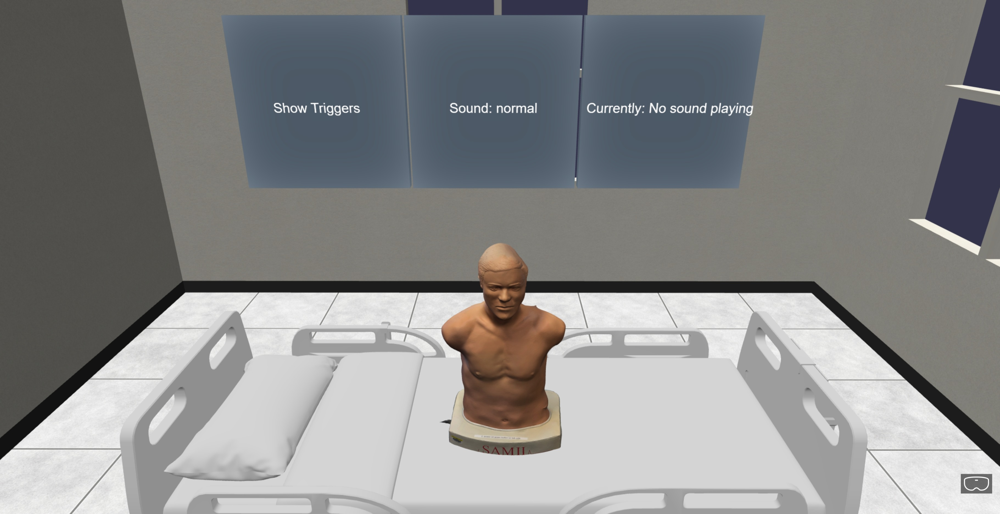
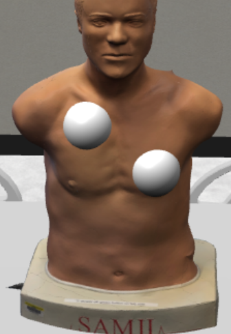
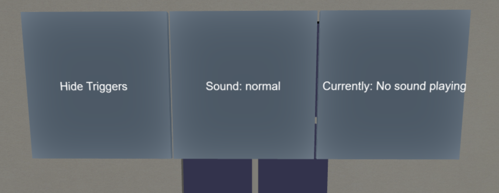

# VR Auscultation Trainer

Welcome to the VR Auscultation Trainer, an immersive training environment designed to help learners practice listening to different auscultation sounds in a virtual setting. This project leverages Babylon.js for 3D rendering, WebXR for VR interactivity, and spatial audio to simulate the experience of using a stethoscope on a clinical simulation mannequin.

## Description

In the VR Auscultation Trainer, you don a Meta Quest headset and enter a virtual environment where a digital 3D model of a SAMII auscultation training dummy awaits. By interacting with the environment using your VR controllers, you can position a virtual stethoscope (represented by the controller grip) against various trigger points on the mannequin’s torso. Each trigger point is associated with a specific sound—such as normal bronchial breathing or heart sounds.

For educational or testing scenarios, different sound sets (normal and intermediate) can be loaded dynamically. This allows trainees to practice identifying various auscultation findings without the need for physical equipment.

## Key Features

- **Immersive VR Environment:** Rendered using Babylon.js and optimized for the Quest headset.
- **3D Clinical Setting:** A virtual SAMII model and hospital bed provide a realistic training environment.
- **Auscultation Points (Triggers):** Place your controller on highlighted trigger points to hear corresponding sounds.
- **Multiple Sound Collections:** Easily switch between "normal" and "intermediate" sound sets during a session.
- **Intuitive UI Controls:** Integrated 3D UI panels let you toggle triggers, change sound collections, and adjust other settings.

## Prerequisites

- A VR headset supporting WebXR (e.g., Meta Quest).
- A modern web browser that supports WebXR (e.g., latest Chrome or Firefox).

## Accessing the Project

The project can be directly accessed and experienced via this URL: [https://dem-1323.github.io/VAT/](https://dem-1323.github.io/VAT/)

Alternatively, follow the steps below to run it locally. Running the project locally allows for customization, testing of new features, and development in a controlled environment. This is particularly useful for developers or instructors who want to modify or expand upon the functionality of the trainer.

### Optional: Installing Locally on Windows

To set up an HTTPS server for your Babylon.js VR project on a Windows machine using Node.js, follow these steps:

1. **Install Node.js:**

   - Download and install Node.js from the [official website](https://nodejs.org/). Choose the latest LTS version for Windows. Run the installer and follow the prompts to complete the installation.

2. **Generate a Self-Signed SSL Certificate:**

   - Use OpenSSL for Windows to generate a certificate (`cert.pem`) and a key (`key.pem`).

3. **Set Up the Node.js HTTPS Server:**

   - **Initialize a New Node.js Project:**
     Open Command Prompt and navigate to your project directory. Run:

     ```bash
     npm init -y
     ```

     This will create a `package.json` file with default settings.

   - **Install Express.js:**

     ```bash
     npm install express
     ```

   - **Create the Server Script:**
     Create a file named `server.js` in your project directory. Add the following code:

     ```javascript
     const express = require("express");
     const https = require("https");
     const fs = require("fs");
     const path = require("path");

     const app = express();

     // Serve static files from the 'public' directory
     app.use(express.static(path.join(__dirname, "public")));

     // Define a route for the root URL
     app.get("/", (req, res) => {
       res.sendFile(path.join(__dirname, "public", "index.html"));
     });

     // Read the SSL certificate and key
     const sslOptions = {
       key: fs.readFileSync(
         path.join(__dirname, "path_to_your_key", "key.pem")
       ),
       cert: fs.readFileSync(
         path.join(__dirname, "path_to_your_cert", "cert.pem")
       ),
     };

     // Create the HTTPS server
     https.createServer(sslOptions, app).listen(3000, () => {
       console.log("HTTPS server is running on https://localhost:3000");
     });
     ```

     Replace `'path_to_your_key'` and `'path_to_your_cert'` with the actual paths to your `key.pem` and `cert.pem` files.

   - **Organize Your Project Files:**
     Create a directory named `public` in your project root. Place your `index.html` and other static files (e.g., CSS, JavaScript, models) inside the `public` directory.

4. **Run the HTTPS Server:**
   In Command Prompt, navigate to your project directory and execute:

   ```bash
   node server.js

   ```

5. **Trust the Self-Signed Certificate:**

   - When you open the project in your browser, it may display a security warning because the certificate is self-signed.
   - Click on the "Advanced" option in the warning message and select "Proceed to localhost" to trust the certificate temporarily. For permanent trust, manually add the certificate to your system's trusted certificates.

6. **Enable VR:**
   - Connect your Meta Quest headset to your computer and ensure it is properly configured.
   - Use a compatible WebXR-enabled browser such as the latest version of Chrome or Firefox.
   - Open the project in your browser and follow the prompts to "Enter VR" mode. This will fully immerse you in the virtual environment.

## Using WebXR API Emulator (If No XR-Capable Device)

If you don’t have an XR-capable device, you can use the [WebXR API Emulator](https://github.com/MozillaReality/WebXR-emulator-extension). This tool allows you to simulate XR interactions and test your project without needing actual hardware.

## Visuals

### Model and Texture Sources

- **SAMII Mannequin Model:** I scanned one of the mannequins from the UMass Boston Center for Clinical Education and Research using Polycam.
- **Hospital Bed Model:** Sourced from Sketchfab: "Simple Hospital Bed" ([https://skfb.ly/owsp8](https://skfb.ly/owsp8)) by Yvo Pors is licensed under Creative Commons Attribution ([http://creativecommons.org/licenses/by/4.0/](http://creativecommons.org/licenses/by/4.0/)).
- **Wall and Floor Textures:**
  - Wall texture sourced from: [https://cdn10.bigcommerce.com/s-9qugz4w/products/18878/images/23667/356185\_\_14245.1461617911.1280.1280.jpg?c=2](https://cdn10.bigcommerce.com/s-9qugz4w/products/18878/images/23667/356185__14245.1461617911.1280.1280.jpg?c=2)
  - Floor texture sourced from: [https://img.freepik.com/premium-photo/stone-marble-mosaic-with-geometric-tiles-design-background_977600-2818.jpg](https://img.freepik.com/premium-photo/stone-marble-mosaic-with-geometric-tiles-design-background_977600-2818.jpg)

### Environment Preview



### Trigger Points



### UI Controls



## Development Challenges

### UI and Interactivity

1. **UI Implementation Issues:**

   - Initially struggled with making the UI buttons properly interactive in VR.
   - Had issues with button positioning and rotation, particularly getting them to face the correct direction.
   - Needed to adjust the UI to work both in VR mode (above controller) and desktop mode (floating above model).

2. **Controller Interaction:**
   - Had to handle proper controller-trigger intersection detection.
   - Needed to ensure controller actions were properly configured and maintained after sound switches.
   - Required special handling for VR controller attachment of UI elements.

### Sound and Trigger Systems

3. **Sound System Challenges:**

   - The primary challenge was implementing the sound collection switching feature.
   - Initially, sounds would stop playing entirely after switching collections.
   - When that was fixed, the wrong sounds would play (e.g., still playing "Normal Heart" when switched to the intermediate collection).
   - Faced issues with properly cleaning up old sounds and attaching new ones to trigger points.

4. **Trigger Point System:**
   - Needed to properly map specific trigger points to their corresponding sounds.
   - Had to ensure trigger points remained interactive after sound collection switches.
   - Required careful management of trigger point visibility toggling.

### Learning and Optimization

5. **Learning Babylon.js:**

   - Needed to learn Babylon.js from scratch, including how to place and move 3D assets within the scene.

6. **Performance Optimization:**
   - The initial environment experienced frame rate drops. Optimization techniques like reducing polygon counts on models in Blender were implemented to ensure a smooth experience. A key resource was a [YouTube tutorial on reducing polygon counts](https://www.youtube.com/watch?v=auTfPdJUxrg&t=100s), which provided practical guidance for optimizing 3D assets.

## Future Improvements

### Sound Enhancements

- **Additional Sound Libraries:** Integrate more varied and condition-specific auscultation sounds to enhance training scenarios.
- **Restructure Sound Collections:** Consult with nursing instructors to better organize which sounds to include in collections.

### User Experience

- **User Customization:** Allow instructors to upload custom sound sets or arrange new trigger points on the model.
- **Realistic Trigger Placement:** Adjust trigger point locations to align more closely with anatomical landmarks typically inspected during auscultation, enhancing realism and usability.

### Technical Improvements

- **Performance Enhancements:** Optimize rendering and interaction for even smoother VR experiences.
- **Add Collisions to Models:** Enable collisions on the bed model, walls, and around the SAMII model to prevent users from clipping through the models while maintaining the usability of interacting with the trigger points.
- **Non-VR Device Support:** Implement support for non-VR devices, enabling interaction with the environment using standard keyboard and mouse controls in a regular browser, to allow for a broader range of users to access the training.

## Authors and Acknowledgements

This project was created as part of a training tool to enhance clinical teaching through VR technology. Additionally, it served as my final project for CS460 - Computer Graphics, where I aimed to leverage the concepts learned in the course alongside innovative technologies to create something both beneficial and enjoyable. My goal was to design a tool that not only provided practical utility but also encouraged experimentation and fun within the realm of VR.

Special thanks to:

- **Professor Daniel Haehn:** For an exceptional course and granting the freedom to explore this VR project as a creative final assignment.
- **Rosemary Samia:** Director of the UMass Boston Center for Clinical Education & Research, for allowing me to scan the SAMII model and recommending [Practical Clinical Skills](https://www.practicalclinicalskills.com/) as a resource for downloading the auscultation sounds.
- **Babylon.js Community:** For providing a robust 3D engine and extensive documentation, especially the [GUI documentation](https://doc.babylonjs.com/features/featuresDeepDive/gui/gui) and the [ActionManager documentation](https://doc.babylonjs.com/features/featuresDeepDive/events/actions), which were instrumental in implementing key features of the trainer.
- **Levonotion Studios:** For their [YouTube tutorial on reducing polygon counts](https://www.youtube.com/watch?v=auTfPdJUxrg&t=100s), which provided practical guidance for optimizing 3D assets.
- **ChatGPT:** For speeding up the development process, helping with Babylon.js concepts, structuring and cleaning up code, and assisting with building the room environment quickly.

Thank you for trying the VR Auscultation Trainer!
